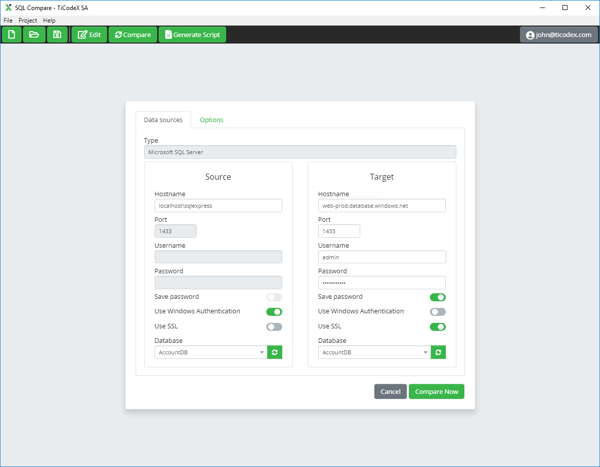
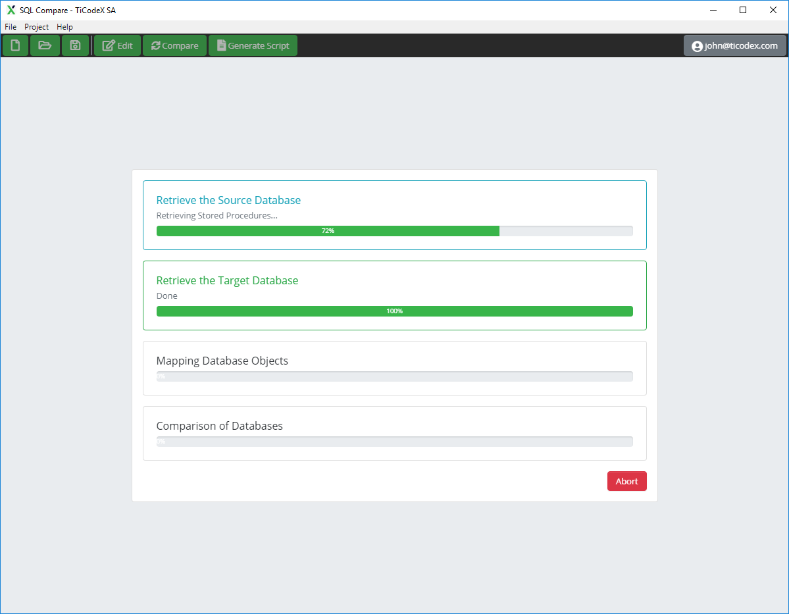
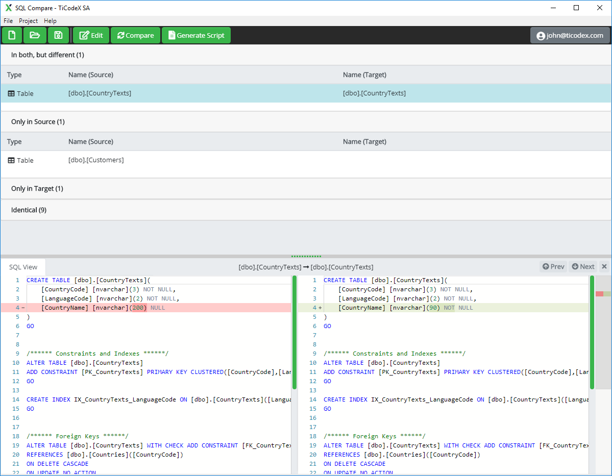

  
  <h1 align="center">SQL Schema Compare</h1>

  
  
  
   
  
  

## Description

The swiss army knife for DB schema comparison and synchronization which runs on multiple OS and supports multiple databases.

TiCodeX SQL Schema Compare runs on Windows, Mac and Linux and connects to Microsoft SQL (MS-SQL), mySQL and PostgreSQL.
In addition, Azure SQL and MS-SQL on Amazon RDS is supported.

## Features

### Supported OS & Languages
- Runs on Windows, Linux and MacOS
- Localized in English, German and Italian

### Supported Databases
- Support for MS-SQL Server 2008 and higher
- Support for Azure SQL Database
- Support for PostgreSQL 9 and higher
- Support for MySQL 5.6 and higher
- Support for MariaDB 5.5 and higher

### Features
- Compare changes between two SQL Database schemas (as example from development to test to production)
- Automatically create full db create scripts
- Automatically generate the db migration script
- Securely save database and server login details
- Support for connections to MS-SQL Server running on Linux
- View database differences and explore schema changes to see what's going on
- Possibility to filter database objects with powerful filtering rules

## Screenshots

  
  
  

## License

[GPL-3.0](https://choosealicense.com/licenses/gpl-3.0/)
